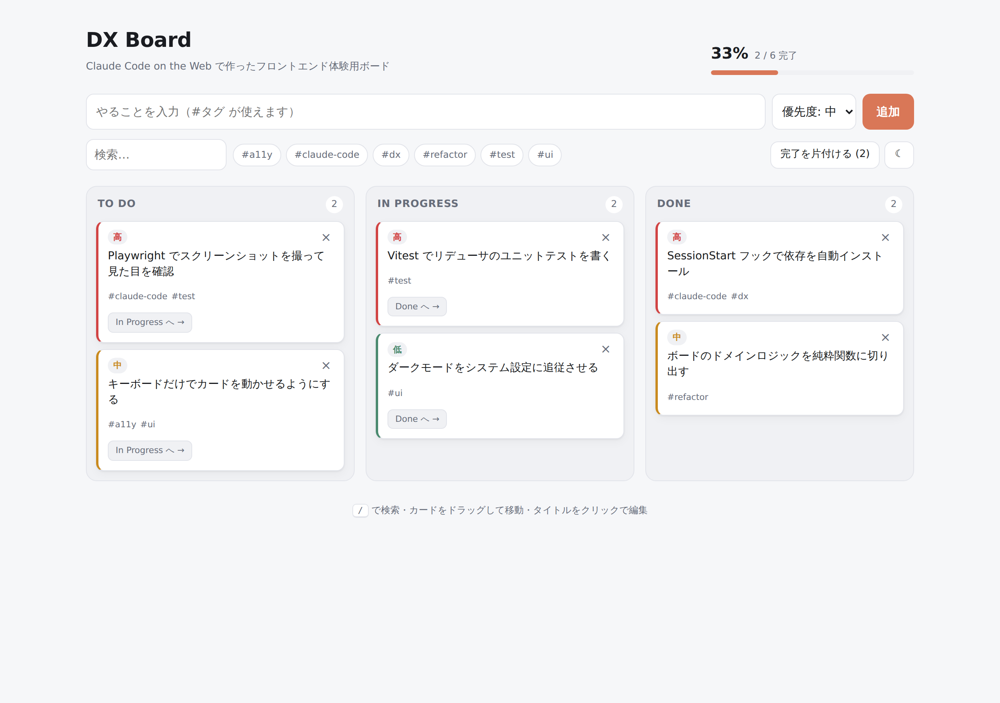

# claude-playground

Claude Code の検証用リポジトリ。**Claude Code on the Web を使ったフロントエンド開発 DX**
を一通り体験するための、動く題材が入っている。

## DX Board

Vite + React 19 + TypeScript のタスクボード。



- タスクの追加・インライン編集・削除、ドラッグ＆ドロップでのカラム移動
- `#タグ` の自動抽出、タグチップと全文検索での絞り込み（AND）
- 優先度による並び替えと完了率の可視化
- ダークモード（システム設定に追従、明示的に選ぶと固定）
- `localStorage` への永続化（壊れた値は読み飛ばす）
- `/` キーで検索へフォーカス

## はじめかた

```bash
npm install
npm run dev        # http://localhost:5173
```

## 開発コマンド

```bash
npm run verify     # typecheck + lint + test
npm test           # Vitest（46 ケース）
npm run screenshot # 実ブラウザで light / dark / mobile を撮影
```

詳しい構成とルールは [CLAUDE.md](CLAUDE.md) を参照。

## Claude Code on the Web 向けの仕込み

| 仕込み | 効果 |
| --- | --- |
| `.claude/hooks/session-start.sh` | Web セッション開始時に `npm install` を実行。開いた直後からテストが走る |
| `.claude/settings.json` | 上記フックの登録 |
| `scripts/screenshot.mjs` | コンテナ同梱の Chromium で UI を撮影。コンソールエラーがあれば失敗させる |
